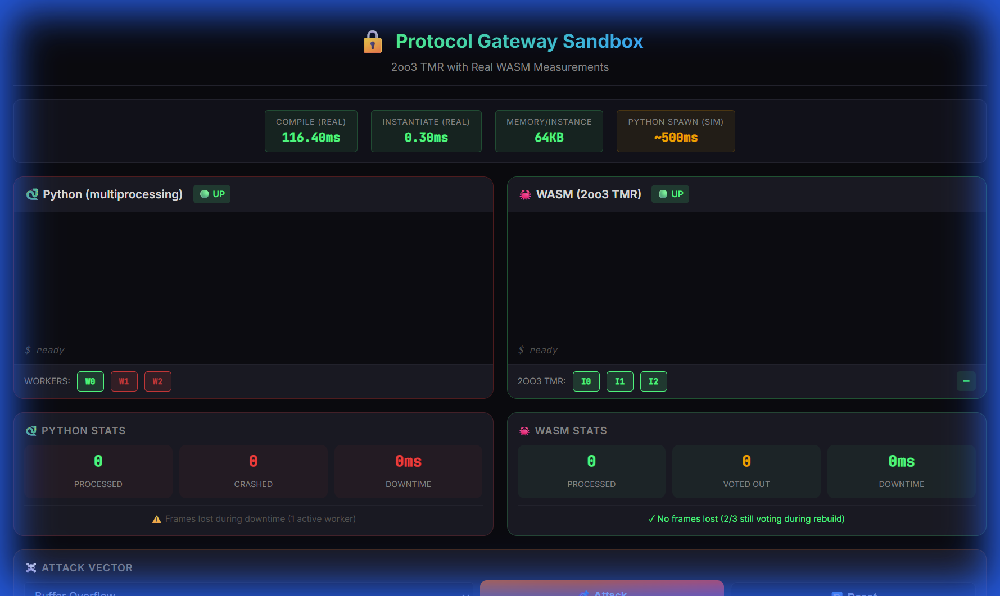
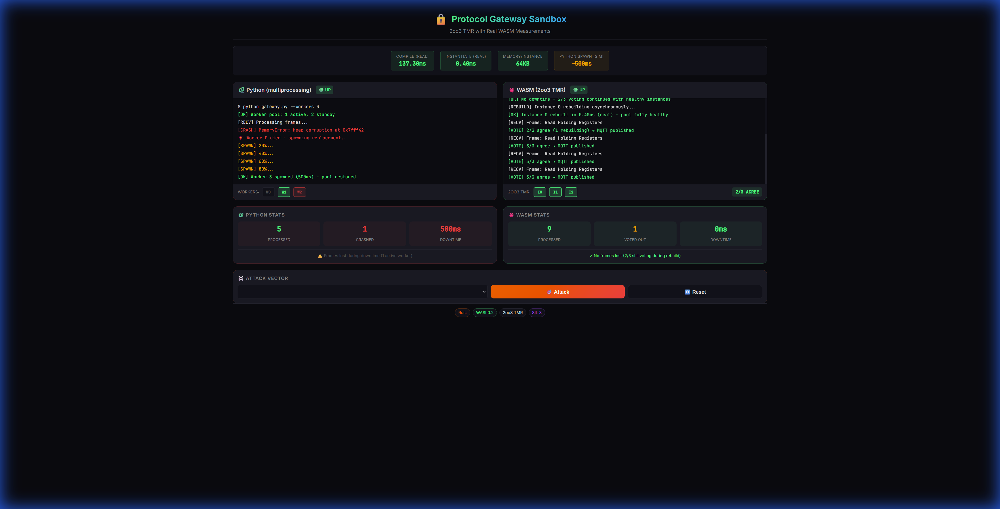
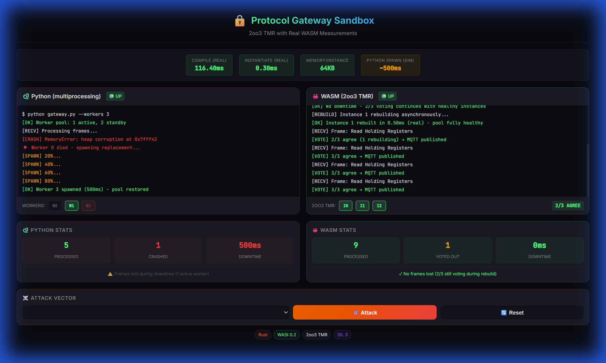
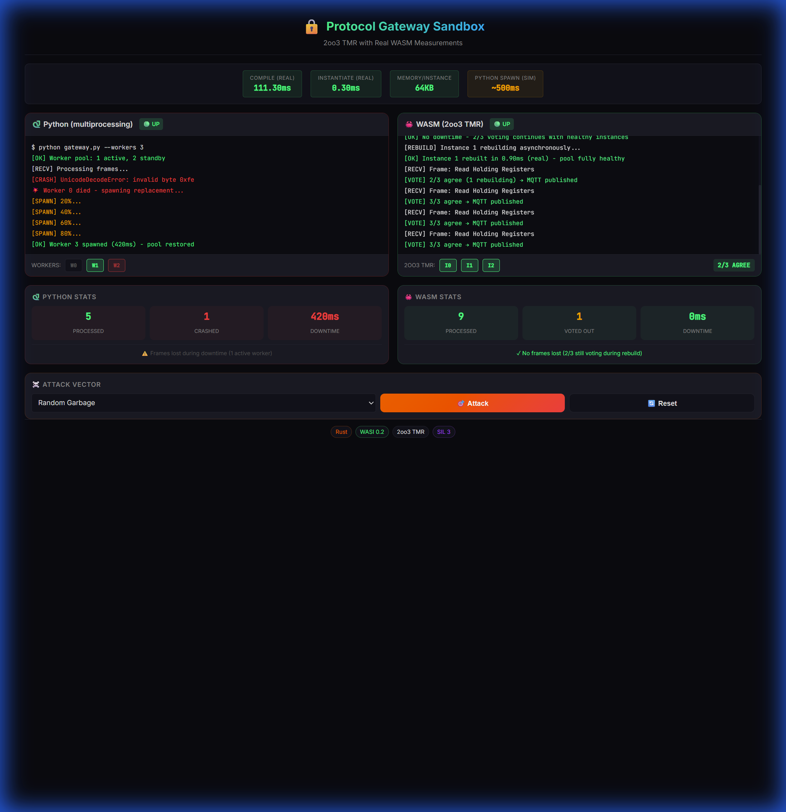

<p align="center">
  
  
  
  
  
  
  
</p>

<h1 align="center">🔒 Protocol Gateway Sandbox</h1>

<p align="center">
  <strong>Safe Legacy Protocol Translation via WASM Sandboxing</strong><br/>
  <em>"How do I connect my 1990s PLC to the cloud without letting hackers into the control loop?"</em>
</p>

<p align="center">
  
  
  <a href="https://protocol-gateway-sandbox.vercel.app"></a>
  
</p>

<p align="center">
  
</p>

---

## 📑 Contents

- [The Security Thesis](#-the-security-thesis) — What problem this solves
- [Architecture](#️-architecture) — How it's built
- [Dashboard Demo](#️-dashboard-demo) — Interactive attack testing
- [Quick Start](#-quick-start) — Run it locally
- [Key Metrics](#-key-metrics) — Python vs WASM comparison
- [2oo3 TMR](#2oo3-triple-modular-redundancy-tmr) — Fault tolerance voting
- [Deployment Targets](#-deployment-targets) — Browser → Pi → Cloud
- [Hardware Demo](#-hardware-demo-coming-soon) — Raspberry Pi coming soon

---

## 🎯 The Security Thesis

**Without WASM:** A buffer overflow in the Modbus parser crashes/owns the gateway, potentially reaching the PLC.

**With WASM:** A buffer overflow in the Modbus parser crashes the WASM instance. The host rebuilds it in **~7ms** (measured). The PLC never sees the attack.

```
┌────────────────────────────────────────────────────────────────────────────────┐
│                         PROTOCOL GATEWAY SANDBOX                                │
├────────────────────────────────────────────────────────────────────────────────┤
│                                                                                │
│   ┌─────────────────┐     ┌──────────────────────────┐     ┌────────────────┐ │
│   │  LEGACY OT      │     │    WASM SANDBOX          │     │   MODERN IT    │ │
│   │  (Modbus TCP)   │     │    (The Parser)          │     │   (MQTT)       │ │
│   │                 │     │                          │     │                │ │
│   │  PLC/RTU        │────▶│  Binary Parser (Rust)    │────▶│  MQTT Broker   │ │
│   │  10.0.0.50:502  │     │  • Decode Modbus PDU     │     │  Cloud/SCADA   │ │
│   │                 │     │  • Validate registers    │     │                │ │
│   │  Function codes:│     │  • Transform to JSON     │     │  Topics:       │ │
│   │  0x03, 0x04     │     │  • Encode to MQTT        │     │  ics/telemetry │ │
│   └─────────────────┘     └──────────────────────────┘     └────────────────┘ │
│                                       │                                        │
│                                       │ ☠️ ATTACK SURFACE                      │
│                                       │ Malformed Modbus = crash WASM, not PLC │
│                                       │                                        │
└────────────────────────────────────────────────────────────────────────────────┘
```

## 🏗️ Architecture

| Component | Technology | Purpose |
|-----------|------------|---------|
| **Modbus Parser** | Rust → WASM | Memory-safe parsing of dangerous binary protocol |
| **Host Runtime** | JavaScript (Node.js) | WASM loader with 2oo3 TMR voting (SIL 3 pattern) |
| **Mock Sources** | JS Shims | Simulated PLC and MQTT broker |
| **Dashboard** | Leptos → WASM | Real-time security console with real WASM measurements |

> 🔗 **See also:** [Vanguard ICS Guardian](https://github.com/gammahazard/vanguard-ics-guardian) — Companion project demonstrating capability-based sandboxing and data diode security.

### IEC 62443 Alignment

Per IEC 62443 attack surface minimization, we implement only:
- `0x03` Read Holding Registers
- `0x04` Read Input Registers

All other function codes are **explicitly rejected**. This is intentional.

### Attack Vectors Tested

| Attack | Description |
|--------|-------------|
| **Buffer Overflow** | "Length Lie" - header claims more bytes than sent |
| **Truncated Header** | Incomplete MBAP header (< 7 bytes) |
| **Illegal Function** | Unsupported codes like `0xFF` |
| **Random Garbage** | Non-Modbus binary noise |

## 📁 Project Structure

```
protocol-gateway-sandbox/
├── wit/                    # WIT interface definitions
│   └── world.wit           # modbus-source, mqtt-sink, metrics
├── guest/                  # Rust WASM component
│   └── src/
│       ├── lib.rs          # Main entry (run function)
│       ├── modbus/         # Protocol parser
│       │   ├── frame.rs    # MBAP header parsing (nom)
│       │   └── function.rs # Function code handlers
│       ├── mqtt/           # Payload builder
│       │   └── payload.rs  # JSON serialization
│       └── metrics_impl.rs # Gateway stats
├── host/                   # JavaScript runtime
│   ├── runtime.js          # **2oo3 TMR voting + crash recovery**
│   ├── shim/
│   │   ├── modbus-source.js
│   │   ├── mqtt-sink.js
│   │   └── chaos-attacks.js
│   └── test/
│       └── fuzz.test.js    # Security invariant tests
├── cli/                    # Node.js CLI demo
│   └── run.mjs             # **Real benchmarks outside browser**
├── legacy/                 # Python "villain" comparison
│   └── vulnerable_gateway.py
├── dashboard/              # Leptos web UI
│   ├── src/lib.rs          # **Real WASM measurements + 2oo3 visualization**
│   └── styles.css          # Security console dark theme
└── docs/
    ├── [ARCHITECTURE.md](docs/ARCHITECTURE.md)     # 2oo3 TMR pattern
    └── [SECURITY.md](docs/SECURITY.md)             # IEC 62443 + SIL 3 alignment
```

## 🖥️ Dashboard Demo

The dashboard shows **two live terminals side-by-side** with **real WASM measurements**:

| Python (Multiprocessing) | WASM (2oo3 Voting) |
|--------------------------|---------------------|
| 3 workers: 1 active, 2 idle | 3 instances: all voting |
| Crash detection only | **Fault detection via voting** |
| ~500ms worker spawn (simulated) | **~4ms instantiate (real)** |
| No fault isolation | Faulty instance identified |

### Interactive Attack Testing

- **4 attack buttons** - Buffer Overflow, Illegal Function, Truncated Header, Random Garbage
- **Run All** - Executes all 4 attacks sequentially with visual progress (green flashing)
- **Real-time metrics** - Compile time, instantiate time, memory usage (all measured)

<details>
<summary><h2>📸 View Attack Demo Screenshots + CLI Benchmark</h2></summary>

### Buffer Overflow
<p align="center">
  
</p>

**Key observations:**
- **Python:** 500ms downtime, frames lost during crash
- **WASM:** 0ms downtime, 2/3 voting continues, instance rebuilt in ~7ms (real)

---

### Illegal Function Code
<p align="center">
  
</p>

---

### Truncated Header  
<p align="center">
  
</p>

---

### Random Garbage
<p align="center">
  
</p>

---

### CLI Benchmark (Node.js)
```
$ node cli/run.mjs

╔════════════════════════════════════════════════════════════╗
║         PROTOCOL GATEWAY SANDBOX - CLI BENCHMARK            ║
╚════════════════════════════════════════════════════════════╝

[OK] Real WASM component size: 64.54 KB
[COMPILE] Module compiled in: 0.62 ms
[INSTANCE 0] Created in: 0.044 ms
[INSTANCE 1] Created in: 0.014 ms
[INSTANCE 2] Created in: 0.013 ms

[FAULT] Instance 1 marked as faulty
[REBUILD] New instance created in: 0.013 ms
[OK] 2oo3 pool restored - voting can continue

┌─────────────────────┬──────────────────┬────────────────────┐
│ Metric              │ WASM (measured)  │ Python (benchmark) │
├─────────────────────┼──────────────────┼────────────────────┤
│ Component Size      │       65 KB      │      ~30-50 MB     │
│ Compile Time        │     0.62 ms      │      ~500 ms       │
│ Instance Create     │    0.024 ms      │      ~500 ms       │
│ Fault Rebuild       │    0.013 ms      │      ~500 ms       │
└─────────────────────┴──────────────────┴────────────────────┘

✓ These are REAL measurements from Node.js
✓ Same WASM component runs in browser, Node.js, and edge devices
```

</details>

### Real vs Simulated Metrics

| Metric | Source |
|--------|--------|
| WASM compile time | ✅ Real `WebAssembly.compile()` |
| WASM instantiate time | ✅ Real `WebAssembly.instantiate()` |
| WASM rebuild time | ✅ Real (re-instantiate during fault recovery) |
| WASM memory | ✅ Real measurement |
| Python spawn time | 🔶 Simulated (~500ms based on benchmarks) |

> 💡 **About the Demo:** This project uses mock data sources for portability. In production, the same WASM component would connect to a real PLC (Programmable Logic Controller) at `modbus://plc:502`.
>
> **Modbus** is a 1979 industrial protocol — think "HTTP for factory machines." **Port 502** is the standard Modbus TCP port, like `:80` for HTTP. The mock shims (`host/shim/`) simulate this traffic so you can run the demo without industrial hardware.

Run locally:
```bash
# Dashboard (browser demo)
cd dashboard && trunk serve
# Open http://localhost:8080

# CLI benchmark (Node.js - proves edge portability)
node cli/run.mjs
# Shows real compile/instantiate times
```

## 🚀 Quick Start

### Prerequisites

```bash
cargo install cargo-component
npm install -g @bytecodealliance/jco
```

### Build & Run

```bash
# Build the WASM component
cd guest && cargo component build --release

# Transpile for Node.js
cd ../host && npx jco transpile ../guest/target/wasm32-wasi/release/*.wasm -o .

# Run the demo
npm run demo

# Run fuzz tests
npm test
```

## 🧪 The "Villain" Comparison

See [`legacy/vulnerable_gateway.py`](legacy/vulnerable_gateway.py) - a realistic Python gateway using `struct.unpack` without bounds checking.

Run both side-by-side to see the difference:

**Terminal 1 (Python - crashes):**
```bash
cd legacy && python vulnerable_gateway.py
# Sends malformed packet → 💥 PROCESS DIES
```

**Terminal 2 (WASM - survives):**
```bash
cd host && npm run demo
# Sends malformed packet → ⚡ WASM traps → 🟢 Rebuilds in ~7ms
```

## 📊 Key Metrics

| Metric | Python | WASM (Cold) | WASM (2oo3 TMR) |
|--------|--------|-------------|-----------------|
| **Crash behavior** | Process dies | Sandbox traps | Sandbox traps |
| **Recovery time** | Manual (~60s) | Auto (~8ms) | **Instant (voting)** |
| **Fault detection** | Crash only | Crash only | **Wrong result detected** |
| **Packets lost** | All in-flight | 1-2 | **0** |

### 2oo3 Triple Modular Redundancy (TMR)

We apply SIL 3 safety patterns (IEC 61508) at the software layer:

```
┌───────────┐     ┌───────────┐     ┌───────────┐
│ INSTANCE 0│     │ INSTANCE 1│     │ INSTANCE 2│
│    ✓      │     │    ✓      │     │    ✗      │
└─────┬─────┘     └─────┬─────┘     └─────┬─────┘
      │                 │                 │
      └────────┬────────┴────────┬────────┘
               │     VOTER       │
               │  2/3 agree ✓    │
               └────────┬────────┘
                        ▼
                  Result: OK
                  Faulty: Instance 2 (rebuild async)
```

**Why 2oo3 over 1oo2?** 
- 1oo2 detects crashes only
- 2oo3 detects crashes **AND wrong results** (Byzantine faults)
- SIL 3 safety systems (Triconex, HIMA) use 2oo3 for emergency shutdown

> ⚠️ **Note:** This project demonstrates SIL 3 voting *patterns*, not a certified SIL 3 implementation. Formal compliance requires third-party assessment per IEC 61508.

### Why WASM 2oo3 Beats Traditional Industrial Solutions

| Solution | Fault Detection | Rebuild Time | Memory |
|----------|----------------|--------------|--------|
| **PLC 2oo3 (Triconex)** | Voting | Hardware | Expensive |
| **Python Multiprocessing** | Crash only | ~500ms | 30-50MB/worker |
| **Docker Restart** | Crash only | ~2-5s | Container overhead |
| **WASM 2oo3** | **Voting** | **~8ms** | **~2MB/instance** |

**Key Advantages of WASM 2oo3:**

1. **Voting Fault Detection**: Identifies *which* instance is faulty, not just that one crashed
2. **Same-Process Isolation**: All 3 instances share the same Node.js process — no IPC overhead
3. **Memory Efficiency**: WASM linear memory is ~2MB per instance vs Python's ~30-50MB
4. **Async Rebuild**: Faulty instance rebuilds in background (~8ms) without blocking voting

## ⚠️ What This Doesn't Solve

WASM + WASI + Rust solve **software security** — not everything:

| ✅ We Solve | ❌ Still Need |
|-------------|--------------|
| Memory safety (Rust) | Network encryption (TLS) |
| Sandbox isolation (WASM) | Authentication (OAuth, certs) |
| Capability control (WASI) | Network redundancy (PRP/HSR) |
| Software fault recovery | Hardware/power redundancy |

See [**Security Analysis**](docs/SECURITY.md#what-each-technology-solves-and-doesnt) for the full breakdown.

## 🔧 Deployment Targets

The same WASM component runs anywhere there's a runtime:

| Platform | Runtime | Use Case |
|----------|---------|----------|
| **Browser** | Built-in (V8) | Dashboard demo (this repo) |
| **Node.js** | V8 / JCO | Development, testing |
| **Edge Devices** | Wasmtime, WasmEdge | Industrial gateways |
| **Embedded** | WAMR | Microcontrollers, PLCs |
| **Cloud** | Fastly, Cloudflare Workers | Serverless edge |

### Example Hardware

| Device | Specs | Notes |
|--------|-------|-------|
| Raspberry Pi 4 | 4GB RAM, ARM64 | Runs Wasmtime natively |
| Industrial PC (Advantech, Moxa) | x64, 2-8GB | Production-ready |
| ESP32 | 520KB RAM | WAMR interpreter mode |

**Key insight:** Write once, deploy to browser (demo), server (test), and edge device (production) with zero code changes.

### 📡 Size & Bandwidth Comparison

For remote deployments with limited connectivity (offshore rigs, remote substations):

| Package | Size | Transfer @ 1 Mbps |
|---------|------|-------------------|
| **WASM Component** | ~68 KB | **<1 second** |
| Docker (Python) | ~500 MB | ~67 minutes |
| Docker (ML stack) | ~2 GB | ~4.5 hours |

*This is why WASM matters for remote ICS environments.*

## 🍓 Hardware Demo (Coming Soon)

> 📖 **[View Full Hardware Setup Guide](docs/hardware-setup.md)** — Wiring diagrams, project structure, and implementation details

The same `.wasm` binary will run on real industrial hardware with actual Modbus communication:

| Hardware | Protocol | What It Proves |
|----------|----------|----------------|
| **Raspberry Pi 4 + USB-RS485** | Modbus RTU on wire | Same WASM, real protocol, real 2oo3 voting |

This works because the project follows the **WASI 0.2 Component Model** — a W3C standard that defines how WASM modules interact with the outside world through capability-based interfaces. The guest component only knows about abstract interfaces (`modbus-source`, `mqtt-sink`), not whether it's running in a browser or on a Pi.

**What stays the same:**
- `guest.wasm` — identical Modbus parser, zero changes
- WIT interface — same `modbus-source`, `mqtt-sink` contracts
- 2oo3 voting logic — same fault detection and recovery

**What we'll build:**
- **Rust host** replacing JavaScript shims with real serial I/O via `serialport`
- `modbus-source` implementation reads from USB-RS485 instead of mock frames
- RGB OLED display shows live parser status and fault recovery times

> 🎬 Demo video coming soon — inject malformed Modbus frames on real RS485, watch WASM trap and recover in milliseconds.

## 🔗 Related Projects

This project is part of the **Reliability Triad** — a portfolio demonstrating WASI 0.2 Component Model across security, protocol translation, and distributed consensus:

| Project | Focus | Demo |
|---------|-------|------|
| [Vanguard ICS Guardian](https://github.com/gammahazard/vanguard-ics-guardian) | Capability-based sandboxing | [Live Demo](https://vanguard-ics-guardian.vercel.app) |
| **Protocol Gateway Sandbox** (this) | Modbus/MQTT translation | [Live Demo](https://protocol-gateway-sandbox.vercel.app) |
| [Raft Consensus Cluster](https://github.com/gammahazard/Raft-Consensus) | Distributed consensus | [Live Demo](https://raft-consensus.vercel.app) |
| [Guardian-One](https://github.com/gammahazard/guardian-one) | **Hardware implementation** | *Private - in development* |

> **Guardian-One** is the hardware implementation of these concepts — a Rust/Wasmtime host running on Raspberry Pi 4 with BME280 sensors, SainSmart relays, and a 3-node Raft cluster for fault tolerance. Hardware demo coming soon.

## 📚 Documentation

- [**Architecture Deep Dive**](docs/ARCHITECTURE.md): 2oo3 TMR voting, "Compile-Once, Instantiate-Many"
- [**Security Analysis**](docs/SECURITY.md): What each technology solves, SIL 3 alignment, limitations

## 📜 License

MIT © 2026
